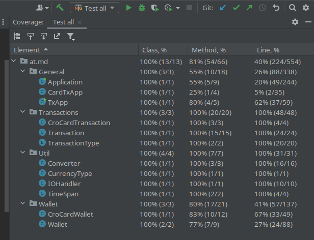

# CryptoParser

Dieses Repository enthält den Quellcode für das CryptoParser-Projekt.

## Projektübersicht

CryptoParser ist eine Java-Anwendung zur Analyse und Verarbeitung von Crypto-Transactions csv's. Es wird mit Maven zum builden verwendet und enthält GitHub-Actions für automatisierte Veröffentlichungen und Testung.

## Inhaltsverzeichnis

- Projektstruktur
- Build-Prozess
- Abhängigkeiten
- Verwendung
- Testumgebung und Automatisierung
- Continous Delivery

## Projektstruktur

Die Hauptkomponenten des Projekts sind:

- Quellcode: Der gesamte Quellcode befindet sich im Verzeichnis src.
- Tests: Unit-Tests sind im Verzeichnis src/test verfügbar.
- GitHub-Aktionen: Der Release-workflow ist in der Datei .github/workflows/release.yml definiert.

## Build-Prozess

Stellen Sie sicher, dass JDK 17 installiert und Maven konfiguriert ist. Dann führen Sie folgenden Befehl aus:

```bash
mvn clean package
```

## Abhängigkeiten

Das Projekt verwendet folgende Abhängigkeiten:

- TestNG für Tests
- Mockito für das Mocking in Tests
- Für genauere Informationen siehe pom.xml


## Verwendung

Um den CryptoParser zu verwenden, gibt es zwei Möglichkeiten:

1. Erstellen Sie das Projekt mit dem bereitgestellten Maven-Befehl und führen Sie es aus.

```bash
mvn clean package
java -jar target/crypto_parser-1.0-SNAPSHOT.jar
```

2. Führen Sie das Docker-Image von Docker Hub aus und geben Sie den Tag für das entsprechende GitHub-Release an.

```bash
docker run -it stefanbicha/crypto_parser:<tag>
```

Ersetzen Sie <tag> durch die gewünschte Versionsnummer.

## Testumgebung und Automatisierung

### Tests:
Unittests werden mit testNG durchgeführt.

Konfiguration der Testumgebung im pom.xml:

```xml
<project>
        ...
    <dependency>
        <groupId>org.testng</groupId>
        <artifactId>testng</artifactId>
        <version>RELEASE</version>
        <scope>test</scope>
    </dependency>
    
    <dependency>
        <groupId>org.mockito</groupId>
        <artifactId>mockito-core</artifactId>
        <version>3.12.4</version> 
        <scope>test</scope>
    </dependency>
    ...
</project>
```

### Testabdeckung:
Die Testabdeckung wird mit der "Run with Coverage"-Funktion von IntelliJ IDEA gemessen.



[Link zum HTML-Report](htmlReport/index.html)

### Testautomatisierung/Build automatisierung:
tests.yml für GitHub Actions-Workflow 

```yml
name: Run Tests

on:
  push:
    tags-ignore:
      - 'v[0-9]+.[0-9]+.[0-9]+'

jobs:
build-and-test:
runs-on: ubuntu-latest

    steps:
      - name: Checkout code
        uses: actions/checkout@v2

      - name: Set up JDK 17
        uses: actions/setup-java@v2
        with:
          java-version: '17'
          distribution: 'adopt'

      - name: Build with Maven
        run: mvn -B package --file pom.xml

      - name: Test with Maven
        run: mvn test
        
```


## Continous Delivery

### Release Workflow

watching for tag "vNumber.number.number":
```yml
name: Publish Release

on:
  push:
    tags:
      - 'v[0-9]+.[0-9]+.[0-9]+'
```

build with maven on java version 17:
```yml
jobs:
  build-and-release:
    runs-on: ubuntu-latest
    steps:
      - name: Checkout Code
        uses: actions/checkout@v2

      - name: Set up JDK 17
        uses: actions/setup-java@v2
        with:
          java-version: '17'
          distribution: 'adopt'

      - name: Build with Maven
        run: mvn clean package
```
run test to nut publish anything if they fail:
```yml
   - name: Test with Maven
       run: mvn test
```

Login to Docker Hub and build Image and push it into the Docker Hub using ${{ github.ref }} witch contains the tag pushed:
```yml
      - name: Login to Docker Hub
        uses: docker/login-action@v1
        with:
          username: ${{ secrets.DOCKERHUB_USERNAME }}
          password: ${{ secrets.DOCKERHUB_PASSWORD }}

      - name: Build and Push Docker Image
        run: |
          docker build -t stefanbicha/crypto_parser:${{ github.ref_name }} .
          docker push stefanbicha/crypto_parser:${{ github.ref_name }}
```

${{ secrets.GITHUB_TOKEN }} is a token provided by github to access repo data in the workflow and authenticate in the context of the repository

${{ steps.create_release.outputs.upload_url }} contains the url generated by the create_release step 

Create Github realese and upload the jar Artifact into the release and print out the name of the docker image:
```yml
      - name: Create Release
        id: create_release
        uses: actions/create-release@v1
        env:
          GITHUB_TOKEN: ${{ secrets.GITHUB_TOKEN }}
        with:
          tag_name: ${{ github.ref }}
          release_name: Release ${{ github.ref }}
          body: |
            Docker image available at `stefanbicha/crypto_parser:${{ github.ref_name }}`

            You need to run the Container with -it to avoid loop while user input lock
          draft: false
          prerelease: false

      - name: Upload Artifact
        uses: actions/upload-release-asset@v1
        env:
          GITHUB_TOKEN: ${{ secrets.GITHUB_TOKEN }}
        with:
          upload_url: ${{ steps.create_release.outputs.upload_url }}
          asset_path: ./target/CryptoParser-1.0-SNAPSHOT.jar
          asset_name: CryptoParser-1.0-SNAPSHOT.jar
          asset_content_type: application/java-archive
```

### Deployment ways

#### Github webhook for releases

+ Set up a webhook in your GitHub repository (Settings > Webhooks) to trigger on release events.
+ On your server, create an endpoint to listen for the webhook.
+ When a release event is received, use the GitHub API to get the latest release.
+ Extract the download URL for the .jar file from the release assets.

#### Docker Hub Webhook

+ Go to Docker Hub and navigate to the repository you want to monitor.
+ Click on the Webhooks tab.
+ Click Add webhook.
+ Enter a name for your webhook and the URL of your listener (the server you set up in step 1). The URL should be the full path, like http://example.com/webhook.
+ Save the webhook.
+ Create a Listener for the Webhook on the Server

#### Other deployment ways:

Docker Image:
+ Watchtower

Github Repo/Release
+ Polling GitHub API